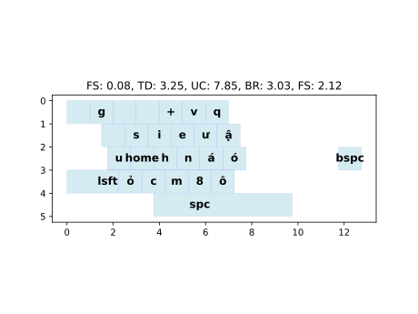

# KSO

A multi-objective optimizer for keyboard keybind layouts using MOEA/D. Optimizes keybind placements.



## Installation

Requires **Python 3.7+**.
After download Python, run this in terminal:
```bash
pip install matplotlib numpy
```

## Project Structure

```
.
├── config/                 # Configuration files (JSON + TXT)
│   ├── assigned_fingers.json
│   ├── available_keys.txt
│   ├── finger_distances.json
│   ├── finger_natural_positions.json
│   ├── fixed_keys.json
│   ├── home_keys.json
│   ├── key_widths.json
│   ├── keystrokes.json     # Your key combinations here
│   ├── layout.txt
│   ├── parameters.json
│   └── target_metrics.json
├── output/                 # Generated layout SVGs
├── run.py                  # Run the code here
└── ...
```

## Usage

>Detailed tutorial about how to config and run is at the end of this!

After edit your desire keystrokes in `config/keystrokes.json`, run this in terminal

```bash
python run.py
```

The algorithm runs for 500 generations by default. Results are saved as SVG images in the `output/` directory:
- `layout.svg` — initial layout
- `top_1.svg` ... `top_5.svg` — best optimized layouts


## Customization

- **Keystrokes:** Edit `config/keystrokes.json` to define your own key sequences and weights.
- **Which key to optimize**: Edit `config/available_keys.txt` to define what key slot is needed for optimize, and edit `config/fixed_keys.json` to define what key slot can't be used.
- **Target priorities:** Edit `config/target_metrics.json` to change which metrics matter most to you.
- **Which finger to press a key**: Edit `config/assigned_fingers.json`
- **Natural finger positions**: Edit `home_keys.json` to change your start finger positions for each keystroke (Ideally your movement keys).
- **Layout:** Edit `config/layout.txt` and `config/key_widths.json` to change the physical keyboard shape.

## Metrics

The optimizer minimizes five objectives (weights set in `target_metrics.json`):

| Metric | Description |
|--------|-------------|
| **finger_cost** | Penalty for placing frequent keys far from the finger's home position, weighted by finger strength (e.g., pinky = expensive). |
| **movement_cost** | Cost of moving fingers between keys during a keystroke sequence. |
| **use_count_cost** | Penalty for overusing individual fingers|
| **roll_cost** | Rewards smooth inward/outward finger rolls; penalizes redirects and same-finger repetition. |
| **distance_cost** | Penalty for fingers deviating from their natural relative spacing (e.g., stretch too wide or close). |

Lower scores are better.

## Detailed Tutorial

### Install python
> imma do it later :)
### Install dependencies
> imma do it later :)
### Config files
#### keystrokes.json
Most of your configuration is here! For each item or combo of items, make this format:
```json
{
  "<name>":{
    "keys": [<key sequence>],
    "weight": <weight>  #How important is it, default is 1
  },
  "<name_2>":{
    "keys": [<key_sequence_2>],
    "weight": <weight_2>
}
```
Example:
```json
{
  "iron_ingot_n_iron_axe": {
    "keys": ["ô", "i", "lsft", "home", "+", "8"],
    "weight": 4
  }
}
```
> Key's names don't have to match my format, but they need to be consistent across files (name mustn't have space).

#### fixed_keys.json

You might want some keys be fixed, then put it here.
```json
{
    "<key_slot>":"<assinged_key>",
    "<key_slot_2":"<assigned_key_2"
}
```
This file always requires your `chat` key. Like the example bellow.

Example (default):
```json
{
    "spc":"spc",
    "mback":"bspc",
    "lsft":"lsft",
    "t":"chat"  #This is required!
}
```
#### available_keys.txt
Key slots you want the algorithm to asign your keybinds are here.
```txt
<key_slot_1> <key_slot_2> <key_slot_3>
```
Example (default)
```txt
` 1 2 3 4 5 6 7
q w e r t y u
a s d f g h j
z x c v b n
```
#### home_keys.json
This algorithm needs to know what key each finger is naturally on (for optimization).
```json
{
    "<hand>_<finger>": "<key_slot>",
    "<hand_2>_<finger_2>": "<key_slot_2>"
}
```
All left hand's fingers required. (right thumb is optional)

Example (default):
```json
{
    "left_middle":"e",
    "left_index":"f",
    "left_pinky":"lsft",
    "left_ring":"s",
    "left_thumb": "spc",
    "right_thumb": "mback"
}
```
#### assigned_fingers.json
Keys that each finger can presses. (more than 1 finger for 1 key isn't supported yet!)
```json
{
    "<hand>_<finger>": [<key_slots>],
    "<hand_2>_<finger_2>": [<key_slots_2>]
}
```
Example (default):
```json
{
    "left_pinky": ["`","1","lsft"],
    "left_ring": ["2","3","w","s","z","q","a"],
    "left_middle": ["4","e","d","x"],
    "left_index": ["5","6","7","r","t","y","u","f","g","h","j","c","v","b","n"],
    "left_thumb": ["spc"],
    "right_thumb": ["mback"]
}
```
It looks like this:


---
