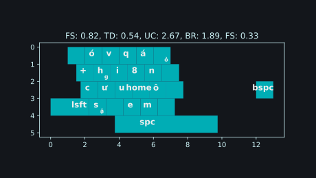

# KSO

A multi-objective optimizer for automatically create keyboard layouts using Parallel Tampering to optimize keybind placements.


<p align="center">



</p>


## Installation

Requires **Python 3.10+**

## Project Structure

```
.
├── config/                 # Configuration files (JSON + TXT)
│   ├── assigned_fingers.json
│   ├── available_keys.txt
│   ├── available_shift_keys.txt
│   ├── max_finger_distances.json
│   ├── finger_natural_positions.json
│   ├── fixed_keys.json
│   ├── fixed_shift_keys.json
│   ├── home_keys.json
│   ├── custom_keys.json
│   ├── keystrokes.json     # Your key combinations here
│   ├── layout.txt
│   ├── parameters.json
│   └── target_metrics.json
├── output/                 # Generated layout SVGs
├── GUI.pyw                 # Executable GUI here
├── run.py                  # Run the code here
└── ...
```
## Usage

>Detailed tutorial about how to config and run is at the end of this!

Double click `GUI.pyw`, that's it!

The algorithm runs for 3000 generations by default. Results are saved as SVG images in the `output/` directory:
- `layout.svg` — initial layout
- `top_1.svg` ... `top_5.svg` — best optimized layouts

## Customization

- **Keystrokes:** Use `Keystroke` tab (`config/keystrokes.json`) to define your own key sequences and weights.
- **Which key to optimize**: Use `Layout` tab (`config/available_keys.txt`) to define what key slot is needed for optimize, and use `Fixed` tab (`config/fixed_keys.json`) to define what key slot can't be used.
- **Target priorities:** Use `Options` tab (`config/target_metrics.json`) to change which metric matter most to you.
- **Which finger to press a key**: Use `Finger Assignment` tab (`config/assigned_fingers.json`)
- **Natural finger positions**: Use `Finger Assignment` tab (`home_keys.json`) to change your start finger positions for each keystroke (Ideally your movement keys).
- **Layout:** Edit `Layout` tab (`config/layout.txt` and `config/custom_keys.json`) to change the physical keyboard shape.

## Metrics

The optimizer minimizes five objectives (weights set in `Options` tab - `target_metrics.json`):

| Metric | Description |
|--------|-------------|
| **finger_strain** | Penalty for placing frequent keys far from the finger's home position, weighted by finger strength (e.g., pinky = expensive). |
| **travel_distance** | Cost of moving fingers between keys during a keystroke sequence. |
| **use_count** | Penalty for overusing individual fingers|
| **bad_roll** | Rewards smooth inward/outward finger rolls; penalizes redirects and same-finger repetition. |
| **finger_stretch** | Penalty for fingers deviating from their natural relative spacing (e.g., stretch too wide or close). |

You can see detailed formulas [here](https://drive.google.com/file/d/1mRARs6CtTvnGyEntORbX8VoSXQE8rjjj/view?usp=sharing).

Lower scores are better.

## Detailed Tutorial


### Install python

#### Use Microsoft Store
Just search for `Python` and install it.

#### Use terminal

1. Open the folder stores your download, extract the script (the name could be different)


2. Click at the folder path, change it to `cmd` and press enter


The terminal will appear with the path of the script folder.


3. Install python by enter: `winget install Python.Python.<python version>`
Recommend: `winget install Python.Python.3.12`


Make sure you reopen the terminal before running any python related command!

### Config files (for people don't want to use GUI)
#### keystrokes.json
Most of your configuration is here! For each item or combo of items, make this format:
```json
{
  "<name>":{
    "keys": [<key sequence>],
    "weight": <weight>  #How important is it, default is average
    "layer": <"both"/"any"/"base"/"shift">
  },
  "<name_2>":{
    "keys": [<key_sequence_2>],
    "weight": <weight_2>
    "layer": <"both"/"any"/"base"/"shift">
}
```
Example:
```json
{
  "iron_ingot_n_iron_axe": {
    "keys": ["ô", "i", "lsft", "home", "+", "8"],
    "weight": 4,
    "layer": "both"
  }
}
```
> Key's names don't have to match my format, but they need to be consistent across files (name mustn't have space).

#### fixed_keys.json

You might want some keys be fixed, then put it here.
```json
{
    "<key_slot>":"<assinged_key>",
    "<key_slot_2":"<assigned_key_2"
}
```
Same with `fixed_shift_keys.json`

This file always requires your `chat` key. Like the example bellow.


Example (default):
```json
{
    "spc":"spc",
    "mback":"bspc",
    "lsft":"lsft",
    "t":"chat"  #This is required!
}
```
#### available_keys.txt
Key slots you want the algorithm to asign your keybinds are here.
```txt
<key_slot_1> <key_slot_2> <key_slot_3>
```
Same with `available_shift_keys.txt`

Example (default)
```txt
` 1 2 3 4 5 6 7
q w e r t y u
a s d f g h j
z x c v b n
```
#### home_keys.json
This algorithm needs to know what key each finger is naturally on (for optimization).
```json
{
    "<hand>_<finger>": "<key_slot>",
    "<hand_2>_<finger_2>": "<key_slot_2>"
}
```
All left hand's fingers required. (right thumb is optional)

Example (default):
```json
{
    "left_middle":"e",
    "left_index":"f",
    "left_pinky":"lsft",
    "left_ring":"s",
    "left_thumb": "spc",
    "right_thumb": "mback"
}
```
#### assigned_fingers.json
Keys that each finger can presses. (more than 1 finger for 1 key isn't supported yet!)
```json
{
    "<hand>_<finger>": [<key_slots>],
    "<hand_2>_<finger_2>": [<key_slots_2>]
}
```
Example (default):
```json
{
    "left_pinky": ["`","1","lsft"],
    "left_ring": ["2","3","w","s","z","q","a"],
    "left_middle": ["4","e","d","x"],
    "left_index": ["5","6","7","r","t","y","u","f","g","h","j","c","v","b","n"],
    "left_thumb": ["spc"],
    "right_thumb": ["mback"]
}
```
It looks like this:

####  base_line.json
Your custom layout, run `python evaluate.py` to get the score of your layout.
```json
{
    "base":{
        "<key_slot>":"<assigned_key>",
        "<key_slot_2>":"<assigned_key_2>"
    },
    "shift":{
        "<key_slot_3>":"<assigned_key_3>"
    }
}
```
Example:
```json
{
    "base": {
        "w": "h",
        "s": "home",
        "d": "q"
    },
    "shift": {
        "4": "ó", 
        "d": "g", 
        "g": "ỏ"
    }
}
```
But remember the number of assigned keys must be the same with number of keys in `keystrokes.json` file!

---
